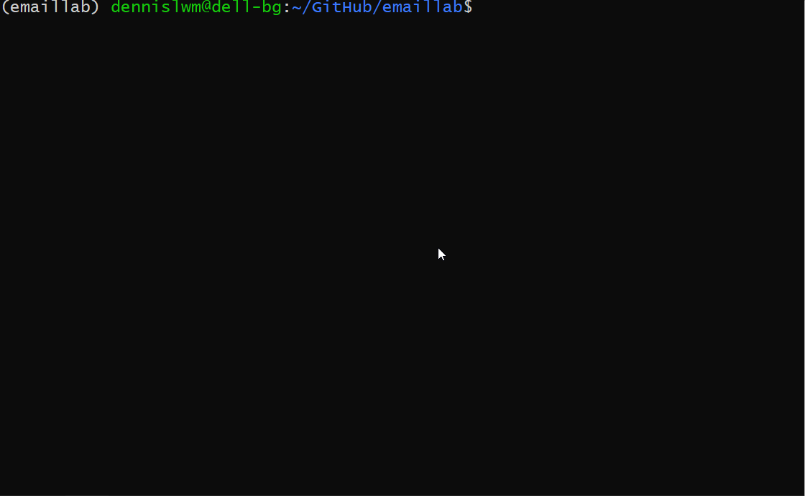

# emaillab

Test driven development ["TDD"] of an email client.

<!-- TOC -->

- [emaillab](#emaillab)
  - [TL;DR](#tldr)
  - [Project](#project)
    - [Creating a config file](#creating-a-config-file)
    - [Creating a pixel tracker](#creating-a-pixel-tracker)
    - [Configuration of pixel tracker](#configuration-of-pixel-tracker)
  - [Usage](#usage)
    - [Installing on your workstation](#installing-on-your-workstation)
    - [Running the CLI](#running-the-cli)
  - [Project Structure](#project-structure)
  - [Test Driven Development](#test-driven-development)
    - [Hosting a SMTP test server](#hosting-a-smtp-test-server)
    - [Creating a test config file](#creating-a-test-config-file)
    - [Running the tests](#running-the-tests)
  - [References](#references)

<!-- /TOC -->

## TL;DR



## Project

Create a CLI tool that we can use to easily send an email via SMTP. The CLI checks if the config file `emaillab.yml` exists. Otherwise it will prompt the user to create a new config file, and asks the user for these required fields (unless specified otherwise):

1. user name
2. user email
3. user password
4. smtp url (default: smtp.gmail.com)
5. smtp port (default: 465)
6. addressee to
7. addressee subject
8. addressee body (type | for multi line)
9. addressee attachment (optional)
10. addressee pixel (optional)

### Creating a config file

If you plan to use the `emaillab` module but not the CLI, you will have to manually create a config file. 

Touch a file `emaillab.yml` in the root folder and copy and paste the following:

```yaml
user:
  name: John Smith
  email: jsmith@gmail.com
  password: password
smtp:
  url: smtp.gmail.com
  port: 465
addressee:
  to: youtube@gmail.com
  subject: hello world
  body: "hello, world\n\n\
    \ Nice to meet you."
  attachment: ''
  pixel: ''
```

### Creating a pixel tracker

This lab uses an online third-party tracker [GoatCounter](https://www.goatcounter.com) to generate a pixel tracker. This can be used to track when an email was opened.

After you login to GoatCounter, you will be able to access your account via a custom subdomain or `[CODE]`, i.e. `https://[CODE].goatcounter.com`. Your account has an endpoint that returns a small 1x1 GIF image.

You don't need to use JavaScript as the endpoint can be loaded as plain HTML directly. The parameter [TAG] can be used to associate an endpoint with the pixel tracker.

Code for the pixel tracker endpoint.

```html
<html><body></body></html>
```

*Note: You'll need to substitute in your values for [CODE] and [TAG].*


### Configuration of pixel tracker

Modify the config file (either by user input or by file), and copy and paste the above HTML code as an addressee pixel.

Edit config file `emaillab.yml`.

```yaml
addressee:
  ...
  pixel: "<html><body></body></html>"
```

## Usage

### Installing on your workstation

Activate the pipenv environment by running `pipenv shell`. Then install the Python dependencies.

```bash
pipenv install
```

### Running the CLI

Ensure that you are in the `pipenv shell` environment first. To use the CLI tool.

```bash
python src/emaillab/main.py
```

To use these modules within your Python script.

```python
from emaillab import config, emaillab
```

---
## Project Structure
     emaillab/                        <-- Root of your project
       |- .gitignore                  <-- GitHub ignore 
       |- demo.gif                    <-- GIF example usage used by README.md
       |- Makefile                    <-- Make 
       |- Pipfile                     <-- Pipenv 
       |- Pipfile.lock                <-- Pipenv lock 
       |- README.md                   <-- GitHub README markdown 
       +- src/
          +- emaillab/                <-- Holds any business logic
             |- __init__.py
             |- config.py             <-- Python module to create or load config
             |- emaillab.py           <-- Python module to compose email and interface with smtplib
             |- main.py               <-- Python module to demo the modules
       +- tests/                      <-- Holds any automated tests
          |- test_config.py           <-- Python script to test config.py
          |- test_emaillab.py         <-- Python script to test emaillab.py

---
## Test Driven Development

For this project, we're using `pytest` as our testing framework. We wrote a line in our `Makefile` that utilizes the `pytest`.

The file `test_config.py` ensures that our `config` module works as expected.

The file `test_emaillab.py` ensures that our `emaillab` module works as expected.

### Hosting a SMTP test server

This lab uses a self-hosted SMTP test server [MailHog](https://www.goatcounter.com) to view receipients' emails. However, this is optional and will not affect the tests.

The `docker-compose.yml` file.

```yaml
services:
  mailhog:
    image: mailhog/mailhog
    ports:
      - 1025:1025 # smtp server
      - 8025:8025 # web ui
```

### Creating a test config file

In order to run the tests, you will have to create a test config file. 

Touch a file `test.yml` in the root folder and copy and paste the following:

```yaml
user:
  name: John Smith
  email: jsmith@gmail.com
  password: password
smtp:
  url: [SERVER_IP]
  port: 1025
  # web interface at http://[SERVER_IP]:8025
addressee:
  to: youtube@gmail.com
  subject: hello world
  body: "hello, world\n\n\
    \ Nice to meet you."
  attachment: ''
  pixel: "<html><body></body></html>"
```

### Running the tests

Ensure that you are in the pipenv environment by running `pipenv shell`. To run the test.

```bash
make
```

To run the test in verbose mode, use `make verbose` instead.

## References

* [Sending HTML email using Python](https://stackoverflow.com/questions/882712/sending-html-email-using-python)

* [Using MailHog via Docker for testing email](https://akrabat.com/using-mailhog-via-docker-for-testing-email)
